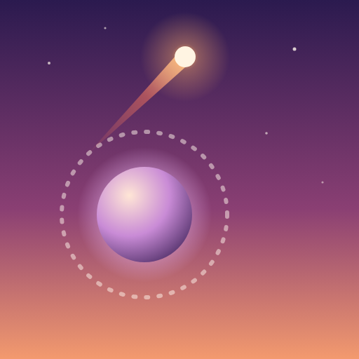

# Tangent

A one-touch arcade game. Your comet orbits a planet. Tap to break orbit and fly off along the tangent. Land inside the next planet's orbit ring to keep climbing, from a warm horizon at dusk up into deep space.



## How to play

- **Tap** anywhere (or press Space) to launch along the direction you're moving.
- Fly into a planet's dashed **orbit ring** to be captured.
- Pass through the **dead center** of a planet for a **Perfect**. Each Perfect in a row is worth one more point, and the chime climbs a note.
- Reach a planet further up to **skip** one and earn a bonus.
- Pick up **stardust** between planets, spend it on new comets, or use it to continue a run.

## What gets harder

| From planet | New element |
| --- | --- |
| 5 | Planets drift side to side |
| 9 | Guard moons circle outside the orbit ring (a coral dashed track) |
| 14 | Cracked planets collapse a few seconds after you land |
| every 15 | A new zone: Dusk, Twilight, Midnight, Aurora, Nebula, Deep Space |

Orbit and flight speed rise slowly with progress, and planets get smaller and further apart.

## Retention hooks already in place

- Instant retry: tap anywhere on the results screen.
- Best score, a "New best!" moment mid-run, and run stats (planets, Perfects, stardust).
- Eight unlockable comets (60 to 1,000 stardust), each with its own trail and effects.
- A daily gift of 25 stardust.
- A one-time "Second chance" per run for 30 stardust, with a 5-second countdown. This is the natural slot for a rewarded ad (`showContinue()` / `revive()` in `index.html`).
- A first-run tutorial with an aim line that turns gold when the shot will land.

Progress is saved in `localStorage`.

## Run it

It's a single static page with no build step.

```sh
npx serve tangent
```

Then open the printed URL on your phone (same Wi-Fi) or in a desktop browser. Opening `index.html` directly also works.

## Ship it

**As an installable web app:** host the `tangent/` folder on any static host (GitHub Pages, Netlify, Cloudflare Pages). `manifest.webmanifest` and the icons let players add it to their home screen, where it runs full screen in portrait.

**On the App Store / Google Play:** wrap it with [Capacitor](https://capacitorjs.com):

```sh
npm init -y && npm i @capacitor/core @capacitor/cli @capacitor/ios @capacitor/android
npx cap init Tangent com.yourstudio.tangent --web-dir tangent
npx cap add ios && npx cap add android
npx cap open ios        # build and submit from Xcode
```

Before submitting, bundle the two Google Fonts (Unbounded, Manrope) locally so the game looks right offline, and swap the stardust continue for a rewarded ad if you want ad revenue.

## Files

- `index.html`: the whole game (canvas rendering, Web Audio sound, UI)
- `manifest.webmanifest`, `icon.svg`, `icon-512.png`, `apple-touch-icon.png`: install metadata and icons
